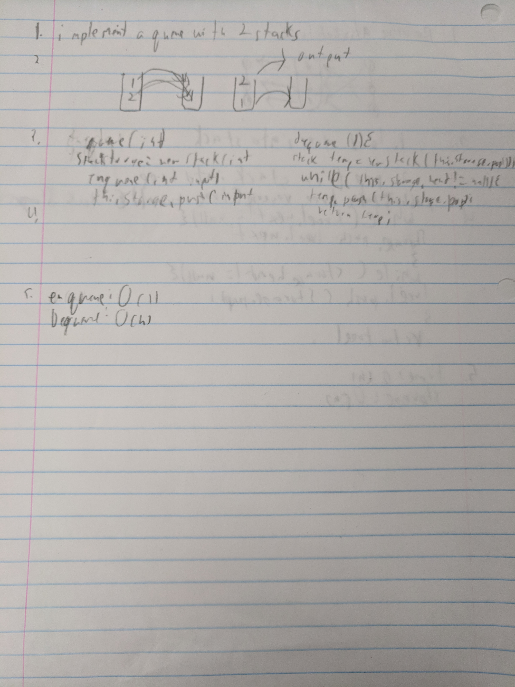

# Implement a Quene with Two Stacks
Create a fifo data structure

## Challenge
store all data for the quene in a stack.

when you need to dequene, pop all data from the storage stack into a new stack

take the first piece of data from the new stack and return it

then push everything from the new stack back into the first.

## Solution

