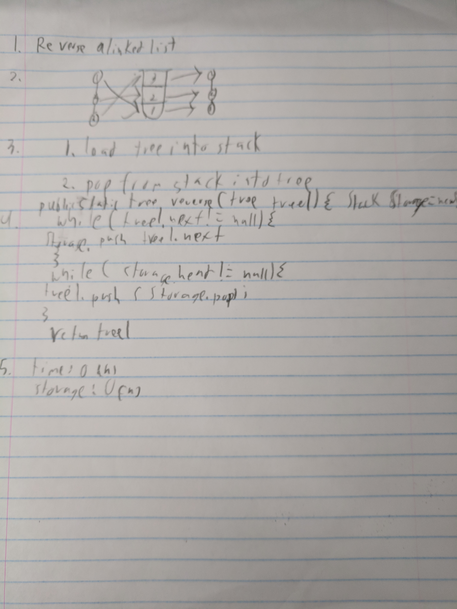

# REverse a Linked List
Take in a linked list and return a list with the same data in the nodes, but linked in opposite order.

## Challenge
Starting with the current node as node 1:

Go through the list and place the data in each node into a stack. Then pop out of the stack, placing each into a new
node and build a linked list.

## Solution

