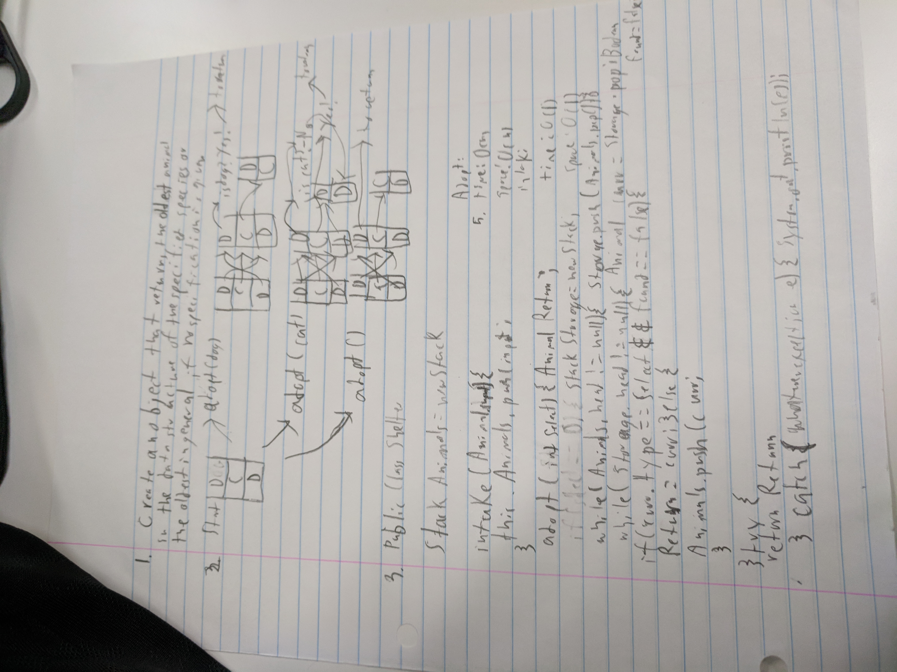

# Create an animal shelter object which creates a quene of animals and can return the animal of a given type which has been there the longest.

## Challenge
Create a stack to store the animals and create three functions:

1. intake:
place an animal on the stack

2. adopt(int):
place everything in the stack onto another stack
push them back on one by one, checking each for matching the int, and assign the found one as returnvalue
as soon as a match is found, skip the check and just push
return the return

3. adopt():
place everything on the stack onto another stack
pop the first from the new stack to return value
pop everything onto the first stack.

## Solution

