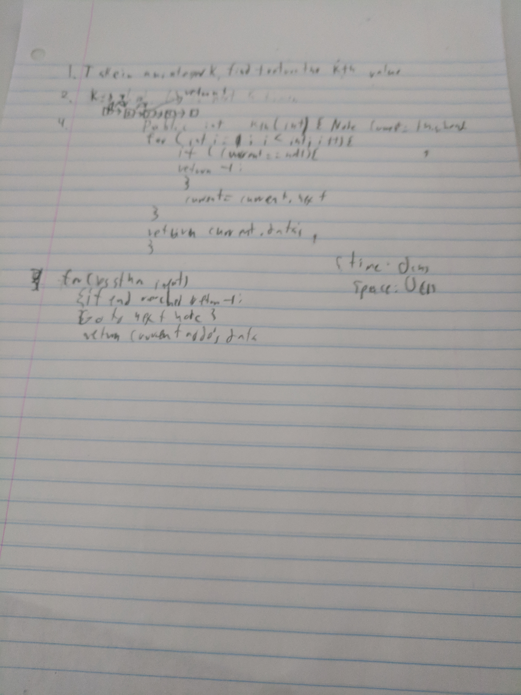

# Retrieve k-th value
Go k nodes deep into a linked list and return the contents of that node.

## Challenge
Starting from the head, find the kth deep node and return the value found there.

## Solution

