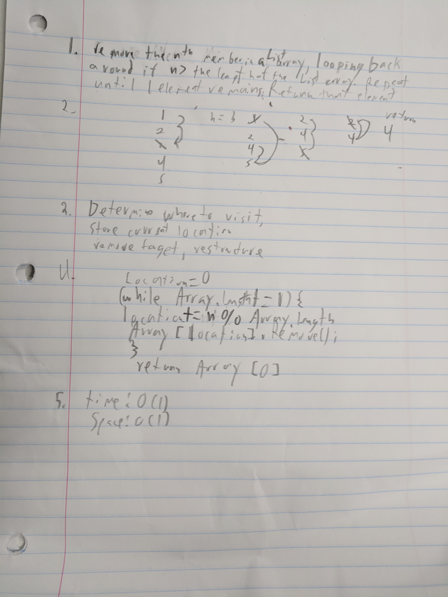

# eenie meenie minie moe
Remove the nth piece of data from a list until there is 1 remaining, each time starting from the index that the last one deleted from.

## Challenge

Remembering the index to start from, properly associating the count with its appropriate index.

## Solution

