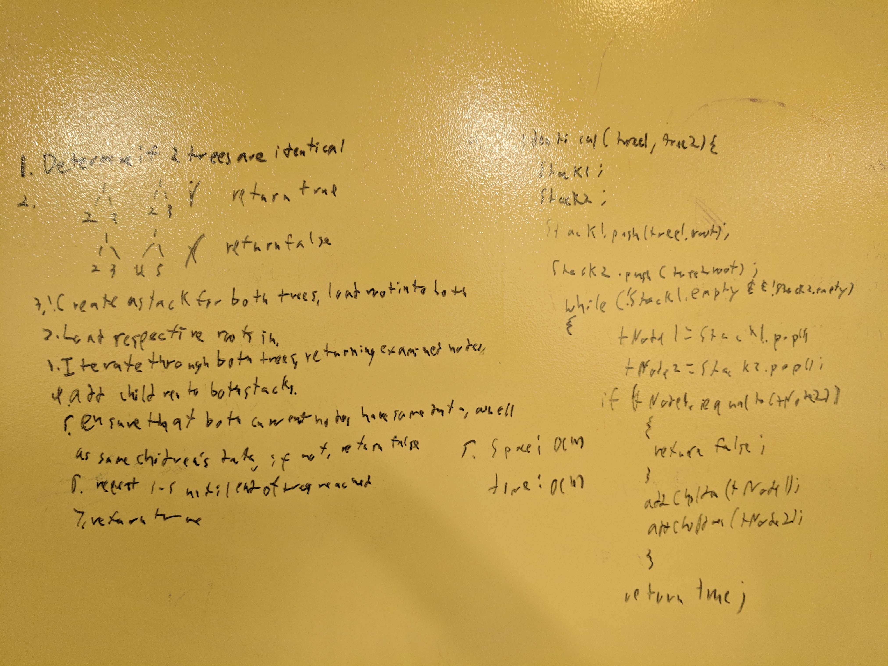

# Determine if two Binary Trees are identical
Given two binary trees, ensure that the nodes contain the same data in the same organization.

## Challenge
Access both trees simultaneously.
Compare the results of iterating through both trees.
Return the corresponding true/false data.

## Solution

